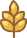

Video game made in [Godot 4](https://godotengine.org/) by [Nokorpo](https://nokorpo.com/) for the [Mermelada Jam 2](https://itch.io/jam/mermelada-jam-2).

- 🥇 1st Place on Canvas.
- 🥇 1st Place in Enjoyment.

You can play it on [itch.io](https://antimundo.itch.io/infinigrass).

## Credits

- [Antimundo](https://antimundo.itch.io/): Programming and game design.
- [Helena](https://hghostt.itch.io/): Art and UI design.
- [Nepo](https://edearth.itch.io/): Game design and sound design.

External assets used:

> Music by [Rrrrrose Azerty](https://loyaltyfreakmusic.com/):
> - Komiku - Animal Summer Music Camp - 09 Acoustic shoegazy blues!
> - Komiku - The adventure goes on, vol.1 - 05 Sweet night and friends
> - Monplaisir - Devast.io Soundtrack - 01 Welcome to Devastation
>
> "Cha-ching!" sound from Pixabay.

## How to play

The objective is to get a lot of the three resources in the game.

|Coin|Barley|Beer|
|-|-|-|
||||

Grab and drag the grass to uproot it. This will give you coins .

With coins  you can:

|Upgrade your pruner|Plant barley|
|-|-|
|||
|Makes uprooting grass easier.|Produces barley.|

With barley  you can:

|Buy goat|Buy fermenter|
|-|-|
|||
|Passively produces coins.|Produces beer.|

With beer  you can:

|Buy laborer|Upgrade your fertilizer|
|-|-|
|||
|Produces barley.|Get more grass and grow it faster.|